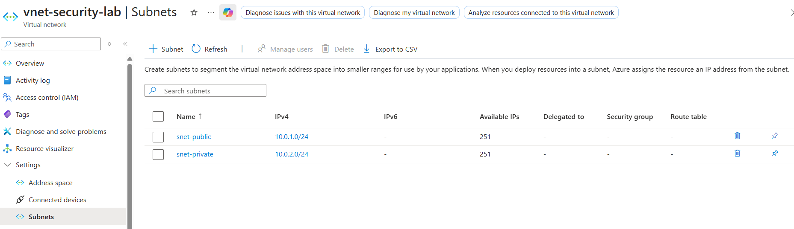
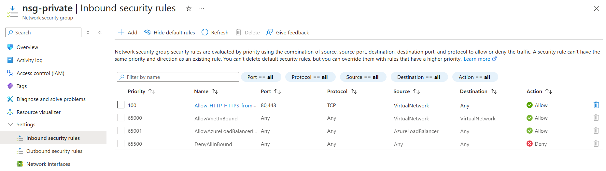
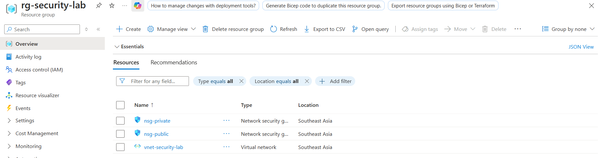

# Phase 1: Foundation Setup

**Completion Date:** December 11, 2024  
**Time Invested:** ~2 hours  
**Status:** ✅ Complete

---

## Overview

Phase 1 established the foundational security infrastructure for the Azure cloud security lab. This phase focused on account security, cost controls, network architecture, and firewall configuration.

---

## Objectives Completed

✅ Secure Azure account with Multi-Factor Authentication (MFA)  
✅ Implement cost management and budget alerts  
✅ Design and deploy Virtual Network with subnet segmentation  
✅ Configure Network Security Groups (NSG) with firewall rules  
✅ Apply professional resource organization and tagging

---

## Architecture Deployed

### Network Topology



**Virtual Network:** `vnet-security-lab`
- **Address Space:** 10.0.0.0/16 (65,536 addresses)
- **Region:** Southeast Asia

**Subnets Created:**
1. **Public Subnet** (`snet-public`)
   - CIDR: 10.0.1.0/24
   - Available IPs: 251
   - Purpose: Internet-facing resources (load balancers, gateways)

2. **Private Subnet** (`snet-private`)
   - CIDR: 10.0.2.0/24
   - Available IPs: 251
   - Purpose: Internal resources (web servers, databases)

---

## Security Controls Implemented

### 1. Account Security
- **Multi-Factor Authentication (MFA)** enabled with:
  - Microsoft Authenticator app (primary)
  - SMS verification (backup)
  - Passkey (biometric authentication)

### 2. Network Security Groups (Firewalls)

#### NSG for Private Subnet



**Name:** `nsg-private`  
**Purpose:** Protect internal resources from direct internet access

**Custom Rules:**
| Priority | Name | Source | Dest Port | Protocol | Action |
|----------|------|--------|-----------|----------|--------|
| 100 | Allow-HTTP-HTTPS-from-VNet | VirtualNetwork | 80, 443 | TCP | Allow |

**Security Principle Applied:** Only allow web traffic from trusted sources within the VNet.

---

#### NSG for Public Subnet


**Name:** `nsg-public`  
**Purpose:** Control internet-facing traffic for load balancers

**Custom Rules:**
| Priority | Name | Source | Dest Port | Protocol | Action |
|----------|------|--------|-----------|----------|--------|
| 100 | Allow-HTTP-from-Internet | 0.0.0.0/0 (Any) | 80 | TCP | Allow |
| 110 | Allow-HTTPS-from-Internet | 0.0.0.0/0 (Any) | 443 | TCP | Allow |

**Security Principle Applied:** Allow only web traffic from internet, deny all other protocols.

---

### 3. Cost Management
- **Budget Alert:** $5 USD monthly limit
- **Alert Thresholds:** 50%, 90%, 100% of budget
- **Notification Method:** Email alerts

---

## Resources Created



**Resource Group:** `rg-security-lab`  
**Location:** Southeast Asia

| Resource Name | Type | Purpose |
|---------------|------|---------|
| vnet-security-lab | Virtual Network | Network infrastructure |
| nsg-private | Network Security Group | Private subnet firewall |
| nsg-public | Network Security Group | Public subnet firewall |

**Tags Applied:**
- Project: CloudSecurityLab
- Environment: Learning
- Phase: 1

---

## Security Principles Demonstrated

### 1. Defense in Depth
Multiple layers of security controls:
- Account-level: MFA
- Network-level: Segmentation
- Resource-level: NSG rules

### 2. Network Segmentation
Separation of public-facing and internal resources:
- Public subnet for internet-exposed services
- Private subnet for application servers
- Traffic flow control via NSG rules

### 3. Least Privilege
- NSG rules allow only necessary traffic
- Specific ports (80, 443) rather than "allow all"
- Default deny for all other traffic

### 4. Default Deny
- All NSGs start with "deny all inbound"
- Only explicitly allowed traffic permitted
- Industry best practice for firewall configuration

---

## Technical Skills Gained

### Networking
- Understanding of CIDR notation (/16, /24)
- IP address planning and subnet design
- Private IP ranges (RFC 1918)
- Subnet math: 2^(32-CIDR) = addresses

### Security
- Firewall rule creation and logic
- Understanding ports (80=HTTP, 443=HTTPS)
- TCP vs UDP protocols
- Source vs destination port concepts
- Network security layering

### Cloud Concepts
- Virtual networking in cloud environments
- Resource organization (Resource Groups)
- Cost management and monitoring
- Tagging strategy for organization

---

## Challenges Overcome

### Challenge 1: MFA Passkey Authentication
**Issue:** Passkey authentication stuck on "waiting for device" during free trial activation.  
**Solution:** Used alternative authentication method (6-digit code from Authenticator app) by clicking "Back" and selecting different sign-in method.  
**Learning:** Always configure multiple MFA methods for redundancy.

### Challenge 2: Subnet Creation UI
**Issue:** Confusion with IPv4 address range dropdown showing "no results found".  
**Solution:** Ignored the dropdown, directly filled in "Starting address" and "Size" fields. Azure auto-calculated the correct range.  
**Learning:** Azure UI can be unintuitive; focus on required fields rather than optional helpers.

### Challenge 3: Understanding Source Ports
**Issue:** Uncertainty about whether to specify source port ranges in NSG rules.  
**Solution:** Learned that source ports are ephemeral (randomly assigned by client), should always be "*" (wildcard).  
**Learning:** Only filter on destination ports (services you're protecting), not source ports (client's random ports).

---

## Key Learnings

### Networking Concepts
- **Private IP addresses (10.0.0.0/8)** are not routable on the internet
- Internet routers are programmed to drop private IP traffic
- **NAT (Network Address Translation)** translates private IPs to public IPs for internet access
- **/24 subnets provide 256 addresses** (but Azure reserves 5, leaving 251 usable)

### Security Best Practices
- **Network segmentation** is foundational to cloud security
- **Default deny** is more secure than default allow
- **Multiple authentication factors** significantly improve security posture
- **Cost monitoring** is part of security (prevents resource abuse)

### Cloud Architecture
- **Resource Groups** provide organizational and permission boundaries
- **Tags** enable cost tracking, automation, and resource management
- **Network Security Groups** are stateful firewalls (track connections)
- **Regions matter** - all resources in same region for lower latency

---

## What's Next: Phase 2

**Upcoming:** Virtual Machine Deployment
- Deploy Linux VM in private subnet
- Configure Azure Bastion for secure remote access
- Install and configure web server
- Test network security rules in action
- Verify traffic flow through NSG rules

**Estimated Time:** 1-1.5 hours

---

## Commands & Configuration Reference

### Subnet Calculations
```
VNet Address Space: 10.0.0.0/16
Total addresses: 2^(32-16) = 2^16 = 65,536

Public Subnet: 10.0.1.0/24
Total addresses: 2^(32-24) = 2^8 = 256
Usable addresses: 251 (Azure reserves 5)

Private Subnet: 10.0.2.0/24
Total addresses: 256
Usable addresses: 251
```

### NSG Rule Logic
```
Priority evaluation: Lowest number = highest priority
Rules evaluated top to bottom until match found
If no match: falls through to default deny
Source port: * (always wildcard for client connections)
Destination port: Specific service ports (80, 443, 22, etc.)
```

---

## Resources & References

- **Azure Virtual Networks:** https://docs.microsoft.com/azure/virtual-network/
- **Network Security Groups:** https://docs.microsoft.com/azure/virtual-network/network-security-groups-overview
- **CIDR Notation:** https://en.wikipedia.org/wiki/Classless_Inter-Domain_Routing
- **RFC 1918 (Private Address Space):** https://datatracker.ietf.org/doc/html/rfc1918

---

**Phase 1 Complete** ✅  
**Next:** [Phase 2: Virtual Machine Deployment](phase2-vm-deployment.md)
