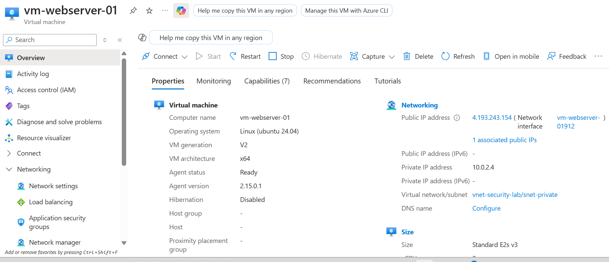
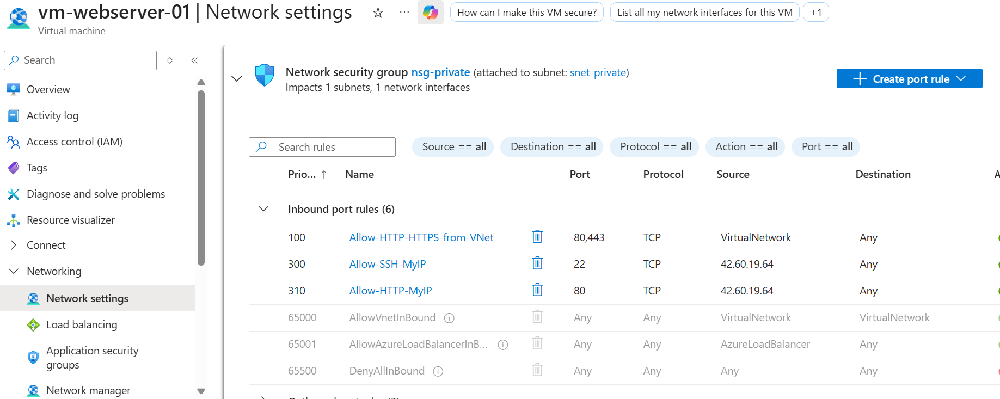
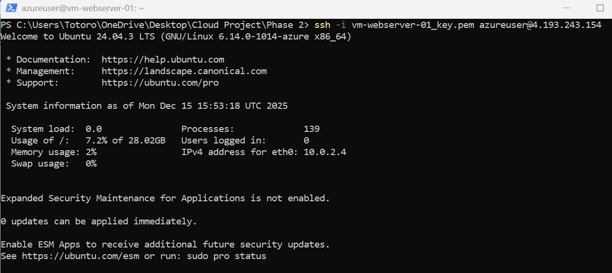

# Phase 2: Virtual Machine Deployment & Web Server

**Completion Date:** December 15, 2024  
**Time Invested:** ~2 hours  
**Status:** ✅ Complete

---

## Overview

Phase 2 focused on deploying a Linux virtual machine in the private subnet and configuring a web server to demonstrate the secure network architecture established in Phase 1.

---

## Objectives Completed

✅ Deploy Linux VM in private subnet with secure access  
✅ Configure SSH key-based authentication  
✅ Install and configure Apache web server  
✅ Create custom webpage  
✅ Configure NSG rules for controlled access  
✅ Verify network segmentation working  

---

## Architecture Deployed



### Virtual Machine Configuration

**Name:** `vm-webserver-01`  
**Location:** Southeast Asia  
**Size:** Standard_E2s_v3 (2 vcpu, 16 GiB memory)  
**Operating System:** Ubuntu Server 24.04 LTS  
**Authentication:** SSH key-based (vm-webserver-01_key.pem)  

**Network Configuration:**
- **Virtual Network:** vnet-security-lab
- **Subnet:** snet-private (10.0.2.0/24)
- **Private IP:** 10.0.2.4 (static assignment within private range)
- **Public IP:** 4.193.243.154 (temporary - for initial configuration)
- **Network Security Group:** nsg-private

**Cost Optimization:**
- Auto-shutdown: 11:00 PM Singapore time
- Standard SSD storage (cost-effective)
- Stopped when not in use

---

## Security Configuration

### Network Security Groups (Firewall Rules)



**Inbound Rules Applied:**

| Priority | Name | Source | Port | Protocol | Action | Purpose |
|----------|------|--------|------|----------|--------|---------|
| 100 | Allow-HTTP-HTTPS-from-VNet | VirtualNetwork | 80, 443 | TCP | Allow | Web traffic from load balancer |
| 300 | Allow-SSH-MyIP | My IP | 22 | TCP | Allow | Secure administrative access |
| 310 | Allow-HTTP-MyIP | My IP | 80 | TCP | Allow | Testing web server access |

**Default Rules:**
- Priority 65000: AllowVNetInBound
- Priority 65001: AllowAzureLoadBalancerInBound  
- Priority 65500: DenyAllInBound (default deny)

**Security Principles Applied:**
- ✅ **Least Privilege:** Only necessary ports opened
- ✅ **Source Restriction:** SSH limited to specific IP
- ✅ **Default Deny:** All other traffic blocked
- ✅ **Defense in Depth:** Multiple security layers (NSG + private subnet)

---

## Deployment Process

### Step 1: VM Creation

**Configuration choices:**
- Deployed in **snet-private** (10.0.2.0/24) for security
- SSH key authentication (more secure than passwords)
- No direct public IP initially planned (temporary IP for setup)
- Associated with nsg-private for firewall protection

### Step 2: SSH Connection



**Established secure remote access:**
```bash
# Set SSH key permissions (Windows PowerShell)
icacls vm-webserver-01_key.pem /inheritance:r
icacls vm-webserver-01_key.pem /grant:r "$($env:USERNAME):(R)"

# Connect to VM
ssh -i vm-webserver-01_key.pem azureuser@4.193.243.154
```

**First connection:**
- Verified host fingerprint (security check)
- Accepted and saved to known_hosts
- Successfully authenticated with SSH key

---

## Web Server Installation

### Step 3: System Updates

Applied security patches and system updates:
```bash
# Update package lists
sudo apt update

# Upgrade installed packages
sudo apt upgrade -y
```

**Why this matters:** 
- Patches security vulnerabilities
- Keeps system up-to-date with latest fixes
- Industry best practice for server hardening

---

### Step 4: Apache Installation

Installed Apache2 web server:
```bash
# Install Apache
sudo apt install apache2 -y

# Verify Apache is running
sudo systemctl status apache2
```

**Service status:**
- ✅ Active: active (running)
- ✅ Enabled: starts automatically on boot
- ✅ Listening on port 80

---

### Step 5: Custom Webpage Deployment


Created custom webpage to demonstrate functionality:
```bash
echo "<h1>Cloud Security Lab - Phase 2</h1>
<p>VM: vm-webserver-01</p>
<p>Private IP: 10.0.2.4</p>
<p>Public IP: 4.193.243.154</p>
<p>Deployed by: Ng Jun Rong</p>
<p>Date: $(date)</p>
<p>Status: Web Server Operational ✅</p>" | sudo tee /var/www/html/index.html
```

**Testing:**
- Local test: `curl http://localhost` ✅
- External test: `http://4.193.243.154` ✅
- Webpage displays correctly in browser

---

## Network Architecture Verification

### Traffic Flow Demonstrated
```
Internet User
    ↓
    Browser Request: http://4.193.243.154
    ↓
NSG-Private (Firewall Check)
    ↓ Port 80 allowed from specific IP
    ↓
VM Public IP: 4.193.243.154
    ↓
VM Private IP: 10.0.2.4
    ↓
Apache Web Server (Port 80)
    ↓
Serve custom webpage
```

**Security verification:**
- ✅ VM deployed in private subnet (10.0.2.4)
- ✅ NSG rules controlling all inbound traffic
- ✅ SSH requires key authentication (no passwords)
- ✅ Only necessary ports exposed
- ✅ Web server accessible but controlled

---

## Key Learnings

### Linux System Administration
- **Package management:** apt update, apt upgrade, apt install
- **Service management:** systemctl status, enable, restart
- **File permissions:** Understanding sudo, file ownership
- **Web server configuration:** Apache document root (/var/www/html)

### SSH Authentication
- **Key-based auth:** More secure than passwords
- **Key permissions:** Proper file permissions required (Windows icacls)
- **Host verification:** Understanding SSH fingerprints
- **Connection troubleshooting:** Debugging timeout, permission issues

### Azure Virtual Machines
- **VM sizing:** Balancing performance and cost
- **Network integration:** VNet, subnet assignment
- **NSG association:** Firewall rules at NIC level
- **Auto-shutdown:** Cost optimization through automation

### Network Security
- **Port management:** Understanding common ports (22=SSH, 80=HTTP)
- **Source IP filtering:** Restricting access by source
- **Default deny posture:** Explicit allow required
- **Defense in depth:** Multiple security layers

---

## Challenges Overcome

### Challenge 1: VM Size Availability

**Issue:** B1s (free tier) VM not available in Southeast Asia region.

**Resolution:** Used Standard_E2s_v3 with "complete and delete" strategy to minimize costs.

**Learning:** Different Azure regions have different VM SKU availability. Plan region selection based on required services.

---

### Challenge 2: VNet Not Appearing During VM Creation

**Issue:** Virtual Network not showing in region dropdown during VM deployment.

**Root Cause:** Region selection not matching VNet location.

**Resolution:** Created VM from Resource Group context, which auto-selected correct region.

**Learning:** Create resources from parent Resource Group for automatic region matching.

---

### Challenge 3: SSH Connection Timeout

**Issue:** Initial SSH connection attempts timing out.

**Root Cause:** NSG not configured to allow SSH from my IP address.

**Resolution:** Added NSG rule "Allow-SSH-MyIP" with source set to "My IP address".

**Learning:** NSG rules must explicitly allow traffic. Default deny blocks everything not explicitly permitted.

---

### Challenge 4: HTTP Access Blocked

**Issue:** Web browser couldn't connect to VM public IP even though Apache was running.

**Root Cause:** NSG didn't have rule allowing HTTP (port 80) from my IP.

**Resolution:** Added "Allow-HTTP-MyIP" rule with source IP and destination port 80.

**Learning:** Even with web server running, network-level firewall (NSG) controls all access. Must configure both application and network layers.

---

## Security Posture Analysis

### Current Security Controls

**✅ Implemented:**
1. **Network Segmentation:** VM in private subnet
2. **Firewall Rules:** NSG controlling all inbound traffic
3. **Authentication:** SSH key-based (no passwords)
4. **Least Privilege:** Only necessary ports open
5. **Access Control:** Source IP restrictions on SSH/HTTP
6. **Cost Controls:** Auto-shutdown, manual stop when not needed

**⚠️ Temporary Compromise:**
- VM has public IP for initial setup/testing
- Will be removed in Phase 3 for production-ready security

---

### Attack Surface

**Current exposure:**
- Public IP: 4.193.243.154 (temporary)
- Open ports: 22 (SSH), 80 (HTTP)
- Restricted to specific source IP

**Mitigation:**
- Strong authentication (SSH keys)
- NSG restricting source IPs
- Regular security updates applied
- Default deny on all other traffic

---

## Cost Analysis

### Phase 2 Spending

**Resources created:**
- VM (Standard_E2s_v3): ~$0.15/hour
- OS Disk (30 GB Standard SSD): ~$0.50/month
- Public IP: ~$0.01/day
- Network bandwidth: Negligible

**Time running:** ~2 hours (with auto-shutdown configured)

**Estimated Phase 2 cost:** ~$0.50-1.00

**Cost optimization measures:**
- Auto-shutdown at 11 PM (saves ~$1.70/day)
- Manual stop when not actively working
- Standard SSD instead of Premium (~$4.50/month savings)
- "Delete with VM" enabled for all associated resources

---

## What's Next: Phase 3 Preview

**Upcoming security hardening:**
- ✅ Remove public IP from VM (eliminate direct internet exposure)
- ✅ Test network isolation (verify VM truly in private subnet)
- ✅ Document secure access methods (for future administration)
- ✅ Verify NSG rules working as intended
- ✅ Complete defense-in-depth implementation

**Expected outcome:**
- VM completely isolated from internet
- No direct attack surface
- Access only through controlled pathways
- Production-ready security posture

---

## Technical Skills Demonstrated

### Cloud Infrastructure
- Azure VM deployment and configuration
- Virtual networking and subnet placement
- Network Security Group management
- Resource tagging and organization
- Cost management and optimization

### Linux Administration
- SSH key authentication setup
- Package management (apt)
- Service management (systemctl)
- Web server installation and configuration
- Basic system monitoring

### Network Security
- Firewall rule creation and testing
- Port and protocol understanding
- Source IP filtering
- Network segmentation principles
- Security testing and verification

### Documentation
- Technical writing and organization
- Screenshot capture for evidence
- Architecture diagramming
- Security analysis and reporting

---

## Resources & References

- **Ubuntu Server Documentation:** https://ubuntu.com/server/docs
- **Apache HTTP Server:** https://httpd.apache.org/docs/
- **Azure Virtual Machines:** https://docs.microsoft.com/azure/virtual-machines/
- **SSH Key Management:** https://docs.microsoft.com/azure/virtual-machines/linux/create-ssh-keys-detailed
- **Network Security Groups:** https://docs.microsoft.com/azure/virtual-network/network-security-groups-overview

---

**Phase 2 Complete** ✅  
**Next:** [Phase 3: Security Hardening](phase3-security-hardening.md) ⏳
