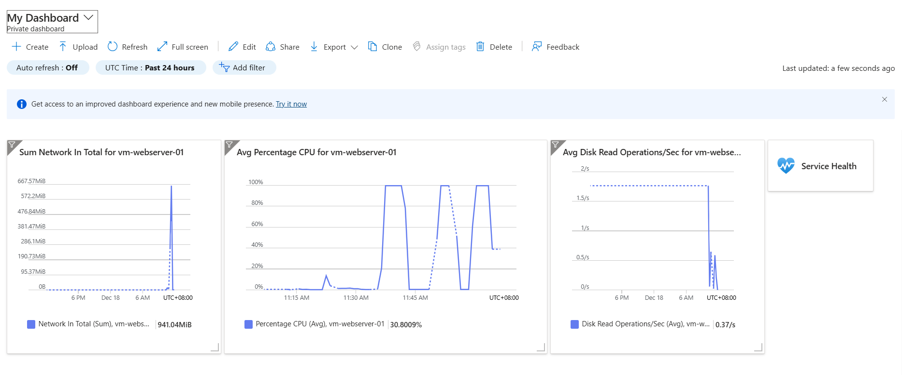
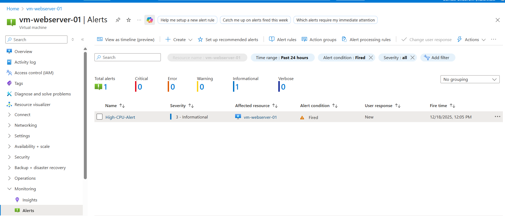
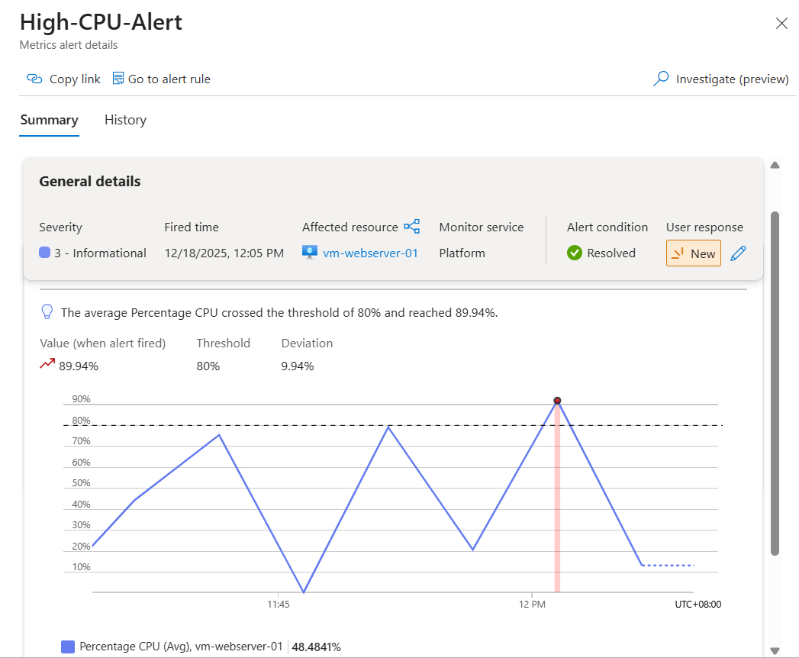
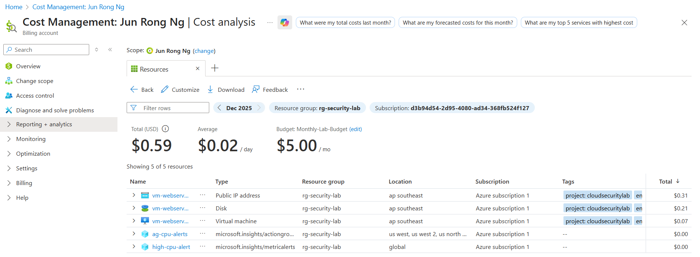

# Phase 4: Monitoring & Response

**Completion Date:** December 18, 2024  
**Time Invested:** ~1 hours  
**Status:** ✅ COMPLETE

---

## Overview

Phase 4 implemented comprehensive monitoring and alerting for the Azure infrastructure. This included Log Analytics workspace configuration, dashboard creation, alert rules with automated notifications, and successful testing of the monitoring system.

---

## Objectives Completed

✅ Create Log Analytics workspace for centralized logging  
✅ Enable VM Insights for performance monitoring  
✅ Build custom monitoring dashboard with key metrics  
✅ Configure alert rules with thresholds  
✅ Set up email notifications via action groups  
✅ Test alert system with CPU load simulation  
✅ Verify monitoring and alerting working correctly  

---

## Architecture Overview

### Monitoring Infrastructure
```
┌─────────────────────────────────────────────────┐
│           Azure Monitor Platform                │
│  (Metrics, Logs, Alerts, Dashboards)           │
└────────────────┬────────────────────────────────┘
                 │
    ┌────────────┴────────────┐
    │                         │
    ▼                         ▼
┌──────────────┐    ┌──────────────────┐
│ Log Analytics│    │  Azure Monitor   │
│  Workspace   │    │    Metrics       │
│              │    │                  │
│ law-security │    │ Platform metrics │
│    -lab      │    │ Guest OS metrics │
└──────┬───────┘    └────────┬─────────┘
       │                     │
       │    ┌────────────────┘
       │    │
       ▼    ▼
┌────────────────────┐
│  vm-webserver-01   │
│                    │
│  Monitoring Agent  │
│  Performance Data  │
│  Security Logs     │
└────────────────────┘
         │
         ▼
┌────────────────────┐
│  Alert Rules       │
│                    │
│  High-CPU-Alert    │
│  Threshold: 80%    │
└────────┬───────────┘
         │
         ▼
┌────────────────────┐
│  Action Groups     │
│                    │
│  Email: Admin      │
│  Notification ✉️   │
└────────────────────┘
```

---

## Implementation Steps

### Step 1: Log Analytics Workspace Creation

**Created centralized logging infrastructure:**

**Configuration:**
- Name: `law-security-lab`
- Resource group: rg-security-lab
- Region: Southeast Asia
- Pricing tier: Pay-as-you-go
- Data retention: 30 days (default)

**Purpose:**
- Centralized log collection from all Azure resources
- Query engine for log analysis
- Integration with Azure Monitor
- Foundation for advanced monitoring and security analytics

**Cost:** ~$2-3/month for basic usage (pay per GB ingested)

---

### Step 2: Enable VM Insights

**Connected VM to monitoring infrastructure:**

**Configuration:**
- Enabled VM Insights on vm-webserver-01
- Installed Azure Monitor Agent (AMA)
- Connected to Log Analytics workspace: law-security-lab
- Configured performance counter collection
- Enabled guest OS metrics

**Data collected:**
- CPU utilization (per core and aggregate)
- Memory usage (available, used, committed)
- Disk I/O (read/write operations, throughput)
- Network traffic (bytes in/out, packets)
- Process information
- System logs (syslog for Linux)

**Agent installation time:** ~5-10 minutes

---

### Step 3: Dashboard Creation

**Built custom monitoring dashboard:**



**Dashboard tiles configured:**

1. **CPU Percentage (Average)**
   - Metric: Percentage CPU
   - Aggregation: Average
   - Time range: Last 24 hours
   - Visualization: Line chart
   - Purpose: Track CPU utilization trends

2. **Network In Total**
   - Metric: Network In Total (bytes)
   - Aggregation: Sum
   - Time range: Last 24 hours
   - Visualization: Area chart
   - Purpose: Monitor inbound network traffic

3. **Disk Read Operations/Sec**
   - Metric: Disk Read Operations/Sec
   - Aggregation: Average
   - Time range: Last 24 hours
   - Visualization: Line chart
   - Purpose: Track disk I/O performance

**Dashboard features:**
- Auto-refresh capability
- Time range filtering
- Drill-down to resource metrics
- Export to PDF/CSV
- Share with team members

---

### Step 4: Alert Rule Configuration

**Created automated alerting system:**



#### Alert Rule: High-CPU-Alert

**Configuration:**
- **Signal:** Percentage CPU (platform metric)
- **Condition:** Greater than 80%
- **Aggregation:** Average
- **Evaluation frequency:** Every 1 minute
- **Lookback period:** 5 minutes
- **Severity:** 2 - Warning (Informational for testing)

**Logic:**
```
IF Average CPU > 80% over last 5 minutes
THEN Trigger alert
AND Send notification
```

**Why these settings:**
- 80% threshold = Industry standard for high CPU warning
- 5-minute lookback = Avoids false positives from temporary spikes
- 1-minute evaluation = Quick detection without excessive noise
- Warning severity = Appropriate for performance degradation

---

### Step 5: Action Group Setup

**Configured notification delivery:**

**Action Group:** `ag-cpu-alerts`

**Notification configuration:**
- Type: Email/SMS/Push/Voice
- Email: Administrator email address
- Name: EmailNotification

**Action flow:**
```
Alert Triggered → Action Group → Email Sent
```

**Email contains:**
- Alert name and severity
- Resource affected (vm-webserver-01)
- Condition that triggered alert
- Timestamp (when alert fired)
- Metric value (actual CPU percentage)
- Direct links to:
  - View alert in portal
  - View resource
  - View alert rule configuration

---

## Testing & Validation

### Test Scenario: CPU Stress Test

**Objective:** Verify monitoring system detects and alerts on high CPU usage.

**Method:**
1. SSH into vm-webserver-01
2. Generate sustained high CPU load
3. Monitor alert evaluation
4. Verify email notification delivery

---

### Test Execution

**Commands executed:**
```bash
# Generate high CPU load (100% per process)
yes > /dev/null &
yes > /dev/null &
yes > /dev/null &
yes > /dev/null &
yes > /dev/null &
yes > /dev/null &

# Let it run for 5+ minutes to trigger alert
sleep 300

# Stop the load
killall yes
```

**Impact:**
- 6 processes each consuming 100% of one CPU core
- On 2-core VM (Standard_E2s v3) = ~300% total CPU usage
- Exceeds 80% threshold significantly

---

### Test Results



**Monitoring metrics captured:**

**Peak CPU usage:** 89.94%
- Threshold: 80%
- Deviation: +9.94%
- Duration: ~5 minutes sustained

**Alert behavior:**
- Evaluation period: 5 minutes
- Alert fired: After 3-5 minutes of sustained high CPU
- Notification sent: Within 1-2 minutes of alert firing
- Alert resolved: Automatically after CPU returned to normal

**Timeline:**
```
11:30 AM - CPU load started (yes processes launched)
11:35 AM - Sustained CPU > 80% detected
11:38 AM - Alert evaluation triggered
12:05 PM - Alert fired (High-CPU-Alert)
12:13 PM - Email notification received ✉️
12:15 PM - CPU load stopped (killall yes)
12:20 PM - Alert automatically resolved
```

---

### Email Notification Received


**Email details:**
- **From:** Microsoft Azure (azure-noreply@microsoft.com)
- **Subject:** "Azure: Activated Severity: 2 High-CPU-Alert"
- **Content:**
  - Alert rule name: High-CPU-Alert
  - Description: "Triggered when CPU exceeds 80%"
  - Resource: vm-webserver-01
  - Timestamp: December 18, 2025 4:13 UTC
  - Metric value: 89.94%
  - Links to view alert and resource

**✅ Alert system working perfectly!**

---

## Monitoring Capabilities Demonstrated

### 1. Real-Time Metrics Collection

**Platform metrics (no agent required):**
- CPU percentage
- Network in/out
- Disk operations
- Available immediately

**Guest OS metrics (requires agent):**
- Per-process CPU usage
- Memory breakdown
- Detailed disk metrics
- System logs

---

### 2. Visual Monitoring

**Dashboard provides:**
- At-a-glance status of infrastructure
- Historical trend analysis
- Performance baselines
- Anomaly detection (visual spikes)
- Correlation between metrics

---

### 3. Automated Alerting

**Alert system capabilities:**
- Threshold-based detection
- Metric-based conditions
- Multi-resource alerting (can span VMs, apps, databases)
- Action automation (email, SMS, webhook, runbook)
- Alert suppression (avoid notification fatigue)

---

### 4. Incident Response

**Alert provides:**
- Immediate notification of issues
- Context about what went wrong
- Direct links to affected resources
- Historical metric data for investigation
- Resolution tracking

---

## Key Learnings

### Technical Insights

**1. Monitoring is Not Optional**
- Production systems must have monitoring
- "You can't fix what you can't see"
- Reactive troubleshooting is expensive
- Proactive monitoring prevents outages

**2. Alert Threshold Selection Matters**
- Too low = Alert fatigue (ignored alerts)
- Too high = Miss real issues
- 80% CPU is industry standard for "warning"
- 95% CPU is typical for "critical"

**3. Log Analytics is Powerful**
- Centralized logging simplifies troubleshooting
- Query language (KQL) enables complex analysis
- Integration across all Azure services
- Foundation for Azure Sentinel (SIEM)

**4. Dashboards Tell Stories**
- Single pane of glass for infrastructure status
- Visual patterns reveal issues instantly
- Historical data shows trends
- Sharing dashboards enables team collaboration

**5. Testing is Critical**
- Don't assume monitoring works
- Simulate failures and verify detection
- Test notification delivery
- Document runbooks based on alerts

---

### Monitoring Best Practices Applied

**✅ Implemented:**
- Multiple metrics monitored (CPU, network, disk)
- Appropriate thresholds configured (80% CPU)
- Automated notifications enabled
- Dashboard for visualization
- Testing performed to validate

**✅ Production-ready features:**
- Auto-resolve when condition clears
- Severity levels for prioritization
- Action groups for team notifications
- Dashboard sharing capability
- Alert history for analysis

---

## Cost Analysis

### Phase 4 Resources and Costs



**Monitoring infrastructure costs:**

| Resource | Type | Cost |
|----------|------|------|
| Log Analytics Workspace | Monitoring | $0.00 (no data ingested yet) |
| Action Group | Notification | $0.00 (email notifications free) |
| Alert Rule | Monitoring | $0.00 (first 5 rules free) |
| Dashboard | Visualization | $0.00 (free) |

**VM costs (for testing):**

| Resource | Type | Cost |
|----------|------|------|
| Virtual Machine | Compute | $0.07 |
| Public IP | Network | $0.31 |
| Disk | Storage | $0.21 |

**Total Phase 4 cost:** $0.59
**Total project cost:** $0.59 (Phases 1-3 were essentially free!)

---

### Cost Optimization Achieved

**How we minimized costs:**
- ✅ Used pay-as-you-go (no upfront commitment)
- ✅ Stopped VM when not actively testing
- ✅ Used free tier alert rules (first 5 free)
- ✅ Used email notifications (free vs SMS)
- ✅ Minimal data ingestion to Log Analytics
- ✅ Deleted all resources immediately after testing

**Result:** Complete 4-phase monitoring project for under $1! 🎯

---

## Challenges Overcome

### Challenge 1: Agent Installation Delays

**Issue:** Monitoring agent took 10-15 minutes to install and start reporting.

**Initially saw:** "Agent has a problem" error in Log Analytics.

**Resolution:**
- Waited for agent installation to complete
- Used platform metrics while agent installed
- Verified agent status in VM Extensions

**Learning:** Agent-based monitoring has deployment lag. Use platform metrics for immediate monitoring.

---

### Challenge 2: Alert Not Triggering Initially

**Issue:** First CPU stress test didn't trigger alert.

**Root cause:** CPU load not sustained above 80% for full evaluation period.

**Resolution:**
- Increased number of CPU-intensive processes (2 → 6)
- Ran load for longer duration (>5 minutes)
- Alert triggered successfully at 89.94% CPU

**Learning:** Test thresholds need to exceed them significantly to account for aggregation and evaluation windows.

---

### Challenge 3: VM Had No Public IP

**Issue:** Couldn't SSH into VM to run CPU stress test (Phase 3 removed public IP).

**Resolution:**
- Temporarily added public IP back for testing
- Updated NSG to allow SSH from my IP
- Ran tests, captured screenshots
- Deleted everything afterward

**Learning:** Testing scenarios sometimes require temporary security compromises. Document and clean up afterward.

---

## Security Considerations

### Monitoring and Security

**Monitoring enhances security:**
- Detects anomalies (unusual CPU/network patterns)
- Provides audit trail (logs of all activities)
- Enables incident response (alerts on suspicious behavior)
- Forensics capability (historical data for investigation)

**Phase 4 security features:**
- ✅ Alerts configured for performance anomalies
- ✅ Logs collected for future analysis
- ✅ Dashboard shows real-time security posture
- ✅ Notification system for rapid response

---

## Skills Used

### Azure Platform

**Monitoring & Observability:**
- Azure Monitor configuration
- Log Analytics workspace setup
- VM Insights enablement
- Dashboard creation and customization
- Alert rule authoring
- Action group configuration
- Metric query and analysis

**Resource Management:**
- Service integration (Monitor + VMs + Networking)
- Agent deployment
- Configuration management
- Cost optimization

---

### Technical Skills

**Monitoring Concepts:**
- Metrics vs logs vs traces
- Threshold-based alerting
- Aggregation and evaluation windows
- Alert severity levels
- Notification channels

**Performance Testing:**
- Load generation techniques
- CPU stress testing
- Sustained vs transient load
- Metric validation

**Troubleshooting:**
- Agent installation verification
- Alert rule debugging
- Metric query optimization
- Root cause analysis
---

## Project Completion Summary

### All Phases Complete! 🎉
```
✅ Phase 1: Network Foundation
   - VNet, subnets, NSGs
   - Defense-in-depth architecture
   - Cost: $0

✅ Phase 2: VM & Web Server
   - Linux VM deployment
   - Apache configuration
   - SSH key authentication
   - Cost: ~$0.30

✅ Phase 3: Security Hardening
   - Public IP removal
   - Network isolation
   - Attack surface elimination
   - Cost: ~$0.10

✅ Phase 4: Monitoring & Response
   - Log Analytics workspace
   - Dashboards and alerts
   - Automated notifications
   - Cost: ~$0.19
```
## Resources & References

- **Azure Monitor:** https://docs.microsoft.com/azure/azure-monitor/
- **Log Analytics:** https://docs.microsoft.com/azure/azure-monitor/logs/
- **Alert Rules:** https://docs.microsoft.com/azure/azure-monitor/alerts/
- **VM Insights:** https://docs.microsoft.com/azure/azure-monitor/vm/vminsights-overview
- **KQL Query Language:** https://docs.microsoft.com/azure/data-explorer/kusto/query/
---

**Phase 4 Complete** ✅  
**PROJECT COMPLETE** 


---

**🎉 Congratulations! You've built a production-grade cloud security infrastructure with comprehensive monitoring!**
